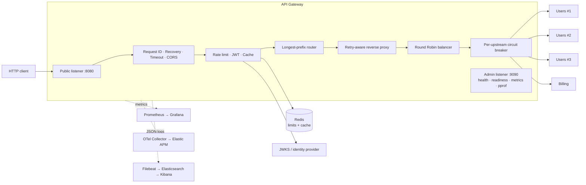

# API Gateway

[](https://github.com/Djunichi/APIGateway/actions/workflows/ci.yml)

A production-minded HTTP API gateway written in Go. It combines reverse
proxying, resilience, authentication, distributed rate limiting, response
caching, and end-to-end observability in a repository that can be started
locally with Docker Compose.

This project is intentionally smaller than a general-purpose edge proxy. Its
goal is to make gateway behaviour explicit, testable, and easy to inspect: the
retry rules, circuit state, Redis failure policies, middleware ordering, and
shutdown lifecycle are all visible in application code.

## What is included

- prefix routing with longest-prefix precedence and optional prefix stripping;
- concurrent per-route Round Robin balancing across multiple upstreams;
- per-route weighted round robin and controlled percentage/header/stable-hash rollouts;
- retries restricted to safe, replayable requests;
- passive upstream health tracking with a circuit breaker per instance;
- configurable active HTTP health checks for each upstream instance;
- global and per-route Redis-backed Token Bucket rate limiting;
- route-level JWT validation against external JWKS providers;
- Redis-backed response caching with authorization and privacy safeguards;
- request IDs, recovery, timeout, CORS, and structured JSON logging;
- Prometheus RED metrics, `pprof`, and OpenTelemetry traces;
- separate public and administrative listeners with graceful shutdown;
- strict YAML configuration and environment overrides;
- unit, real-network integration, race, coverage, and load-test workflows.

## Architecture



The public listener handles proxied traffic only. Operational endpoints live
on a separate admin listener, so health checks and diagnostics do not share the
public routing surface.

For every request, the gateway selects the most-specific configured prefix.
`/api/billing/` therefore wins over `/api/`, and the configured prefix can be
removed before forwarding:

```text
/api/users/42                    → Users  /users/42
/api/billing/invoices/inv-1002  → Billing /invoices/inv-1002
```

## Quick start

Requirements: Docker with Compose and enough resources for the selected stack.

Start the gateway, Redis, three Users instances, Billing, and the demo identity
provider:

```bash
docker compose up --build
```

The public Billing route is immediately available:

```bash
curl http://localhost:8080/api/billing/invoices
curl http://localhost:8080/api/billing/invoices/inv-1002
curl -X POST http://localhost:8080/api/billing/payments
```

The Users route requires a token. In PowerShell:

```powershell
$token = (Invoke-RestMethod -Method Post `
  -Uri http://localhost:8084/token `
  -Authentication Basic `
  -Credential ([pscredential]::new('gateway-demo', (ConvertTo-SecureString 'gateway-demo-secret' -AsPlainText -Force))) `
  -Body @{ grant_type = 'client_credentials'; scope = 'users.read' }).access_token

Invoke-RestMethod http://localhost:8080/api/users `
  -Headers @{ Authorization = "Bearer $token" }
```

Repeated Users requests rotate between `backend-1`, `backend-2`, and
`backend-3`. The included identity service is deliberately limited to local
demonstration; an optional [Keycloak deployment](deployments/keycloak) shows the
same gateway contract with a real OIDC provider.

## Full observability demo

The optional override adds Prometheus, a provisioned Grafana dashboard,
Elasticsearch, Kibana, Filebeat, Elastic APM Server, and an OpenTelemetry
Collector:

```bash
docker compose -f docker-compose.yml -f deployments/observability/docker-compose.yml up --build
```

| Interface | URL | Purpose |
| --- | --- | --- |
| Grafana | http://localhost:3000 | Provisioned `API Gateway Overview` dashboard (`admin` / `admin`) |
| Prometheus | http://localhost:9091 | Metrics and target inspection |
| Kibana | http://localhost:5601 | Structured logs and APM traces |
| Gateway admin | http://localhost:9090 | Health, readiness, metrics, and `pprof` |

The dashboard is loaded from version-controlled JSON and becomes the Grafana
home page on startup. See the [observability guide](deployments/observability/README.md)
for all endpoints, resource requirements, and local security limitations.

## Request and failure semantics

### Routing and balancing

Routes are ordered by prefix specificity, not YAML order. Every route owns its
balancer, so upstream rotation and health state do not leak between services.
The balancer is behind a small consumer-defined interface; additional
algorithms can be introduced without coupling routing to a concrete strategy.

Routes select the algorithm explicitly with `balancer`; it defaults to
`round_robin`. Positive `weights` are accepted only when
`balancer: weighted_round_robin` is selected.
For gradual rollout, `rollout` treats the final upstream as the canary:

```yaml
    balancer: weighted_round_robin
    weights: [3, 1]
    rollout:
      strategy: stable_hash
      percentage: 10
      stable_hash: X-User-ID
```

`percentage` hashes `X-Request-ID`, `header` selects the canary when its header
is present, and `stable_hash` hashes the named header. Percentages and metric
labels are bounded; an unavailable canary falls back to the primary pool.

### Safe retries

`max_attempts` includes the initial request and is capped at 10. Automatic
retries are allowed only for `GET`, `HEAD`, and `OPTIONS`, and only when the
body is absent or replayable through `GetBody`. Unsafe methods such as `POST`,
`PUT`, `PATCH`, and `DELETE` are sent once. Each retry observes both the request
context and a per-attempt timeout.

This avoids duplicating side effects merely because an upstream connection
failed after a request may have been processed.

### Passive health and circuit breaking

Each upstream instance owns an independent circuit breaker. Configured 5xx
responses and transport failures count against that instance; client
cancellation does not. Open instances are skipped until their timeout permits a
probe. If every instance is unavailable, the gateway returns `503 Service
Unavailable` instead of selecting a known-unhealthy destination.

Active checks probe each upstream's `/healthz` endpoint every 10 seconds with a
2-second timeout. HTTP 2xx–3xx responses count as healthy; three consecutive
failures mark an instance unavailable, while two consecutive successes recover
it. Configure `active_health_check` to change the path, cadence, timeout, or
thresholds.

### External state and degradation policy

Routes may opt into the first concrete discovery provider, DNS, instead of
listing `upstreams` explicitly:

```yaml
  - path_prefix: /api/users/
    discovery:
      provider: dns
      name: users
      scheme: http
      port: 8080
      interval: 30s
      grace: 2m
```

DNS resolution happens while preparing a new configuration snapshot. A failed
lookup therefore leaves the last successfully published route snapshot serving
traffic; readiness is not withdrawn for a discovery outage in this first
version. Passive health still returns `503` when every retained instance is
unavailable. `interval` and `grace` are accepted as the contract for the next
step, which will refresh DNS without requiring a configuration-file change.

Rate-limit counters and cached responses live in Redis, keeping behaviour
consistent across gateway replicas. Atomic Token Bucket updates are performed
server-side. Storage contracts are internal and replaceable by another
Redis-compatible implementation without exposing a public SDK.

Redis failures are explicitly configurable. The Docker demo uses fail-open for
rate limiting and caching so a storage outage does not become a total gateway
outage. Authentication remains fail-closed: a missing, invalid, expired, or
insufficiently scoped token never reaches a protected upstream.

### Cache isolation

Caching is opt-in per route. Only public `GET` and `HEAD` requests qualify.
Requests carrying `Authorization`, and responses containing `Set-Cookie`,
`Cache-Control: private`, or `Cache-Control: no-store`, bypass storage. Bodies
and storage operations have explicit size and time limits.

### Lifecycle

Configuration is parsed and validated before listeners start. The gateway
polls the same YAML file periodically (configurable with
`-reload-interval`, default `30s`) and reloads it when its metadata changes.
The candidate is fully
parsed, environment-overridden, validated, and wired before it is atomically
published; invalid candidates leave the previous configuration serving
traffic. Listener addresses are immutable during reload. Unknown YAML
fields, multiple documents, invalid durations or URLs, duplicate route prefixes,
and duplicate upstreams fail startup. Readiness becomes successful only after
both listeners are open, changes to unavailable before shutdown, and then both
servers drain within the configured deadline.

### Dynamic and static configuration

The file watcher periodically checks the configuration file. The default
interval is configured in YAML and can be overridden with
`-reload-interval`; setting it to `0` disables polling. A reload is
transactional: the candidate is parsed, validated, and wired first. If any
step fails, the previous runtime remains active and continues serving traffic.

Dynamic settings, applied to new requests after a successful reload, include:

| Dynamic settings | Notes |
| --- | --- |
| `routes`, upstreams, prefix stripping | New routing runtime is built atomically |
| retry and circuit-breaker policies | Applies to newly built proxy handlers |
| authentication providers and route auth | Providers are revalidated during reload |
| rate-limit and cache policies | Shared external state is preserved where possible |
| middleware timeout and CORS | In-flight requests keep their old handler |
| `active_health_check` policy | New checks use the candidate configuration |

Static settings, which require a restart, include:

| Static settings | Reason |
| --- | --- |
| `server.address`, `admin.address` | Existing listener sockets are retained |
| listener-level read/write/idle timeouts | Owned by the existing `http.Server` |
| process logging and startup environment | Initialized during process startup |
| Redis backend connections and registrations | Created during startup |
| telemetry exporter lifecycle | Startup-owned resources are reused |
| process flags and environment variables | Read during initialization |

Address changes are rejected during reload. Other static changes remain at
their previous runtime values until restart. Requests already in flight are
allowed to finish using the old runtime.

## Configuration

Local defaults are in [`configs/gateway.yaml`](configs/gateway.yaml); Docker
uses [`configs/gateway.docker.yaml`](configs/gateway.docker.yaml). A shortened
example:

```yaml
reload:
  interval: 30s

retry:
  max_attempts: 3
  per_attempt_timeout: 2s
  backoff: 25ms
  statuses: [502, 503, 504]

circuit_breaker:
  failure_threshold: 5
  open_timeout: 30s
  failure_statuses: [502, 503, 504]

routes:
  - path_prefix: /api/billing/
    upstreams: [http://localhost:8091]
    strip_prefix: true

  - path_prefix: /api/
    upstreams:
      - http://localhost:8081
      - http://localhost:8082
      - http://localhost:8083
    strip_prefix: true
```

Selected process and tracing settings can be overridden through
`GATEWAY_*` environment variables. The complete schema and runnable values are
best understood from the two checked-in configuration files; strict loading
ensures they remain executable documentation.

## Operational surface

The admin server listens on `:9090` by default:

| Endpoint | Meaning |
| --- | --- |
| `GET /healthz` | Process liveness |
| `GET /readyz` | Traffic readiness; `503` before startup and during shutdown |
| `GET /metrics` | Prometheus metrics |
| `GET /debug/pprof/` | Go runtime profiling |

Metrics cover request rate, status, latency, response size, in-flight requests,
routes, upstream attempts, retries, auth, cache and rate-limit decisions, plus
Go runtime and process state. Labels are bounded: raw paths, request IDs,
subjects, and tokens are never used as metric labels. Logs and traces share
`trace_id` and `span_id` for correlation.

## Why build this instead of configuring an existing proxy?

This repository is not presented as a drop-in replacement for mature,
security-hardened proxies. It is an application-level gateway for studying and
demonstrating the engineering trade-offs that those products encapsulate.

| | This project | Nginx | Envoy | Traefik |
| --- | --- | --- | --- | --- |
| Primary fit | Inspectable Go gateway and tailored application policies | Proven web server, reverse proxy, buffering, caching, and static edge configuration | High-performance L4/L7 data plane, service mesh, rich resilience, and xDS control planes | Cloud-native ingress and edge routing driven by infrastructure providers |
| Configuration model | Strict static YAML plus selected environment overrides | Declarative server/location/upstream configuration | Static bootstrap or dynamic xDS APIs | Static install configuration plus dynamic provider-discovered routing |
| Discovery and live updates | Static upstream list with transactional file reload | DNS and configuration reload patterns; advanced capabilities vary by edition | Extensive LDS/RDS/CDS/EDS/SDS discovery through xDS | Native Docker, Kubernetes, Consul, file, and other providers |
| Resilience in scope | Safe retries and passive per-instance circuit breakers | Mature upstream retry/failover primitives | Broad circuit breaking, outlier detection, health checking, retry budgets, and load balancing | Middleware/service-oriented retry, health, and balancing features |
| Extensibility | Direct Go packages and small internal interfaces | Modules and njs | HTTP/network filters, Wasm, dynamic modules, and control-plane APIs | Middleware, plugins, and provider ecosystem |
| Best reason to choose it | You need to understand or own the policy code end to end | You need a mature, efficient general-purpose reverse proxy or web edge | You need service-mesh-grade protocols, discovery, and control-plane integration | You want low-friction routing that follows orchestrator state |

Choose [Nginx](https://nginx.org/en/docs/http/ngx_http_proxy_module.html) for a
widely deployed general-purpose web edge and mature proxy/cache controls.
Choose [Envoy](https://www.envoyproxy.io/docs/envoy/latest/intro/arch_overview/arch_overview)
when dynamic [xDS configuration](https://www.envoyproxy.io/docs/envoy/latest/intro/arch_overview/operations/dynamic_configuration),
multiple protocols, or service-mesh-grade traffic management are requirements.
Choose [Traefik](https://doc.traefik.io/traefik/reference/install-configuration/providers/overview/)
when routes should follow Docker, Kubernetes, or other provider state with
minimal control-plane work. Choose this project when explicit Go code,
controlled scope, and explainable policy behaviour are the point.

## Quality gates

GitHub Actions runs independent build, unit, and integration jobs:

| Job | Checks |
| --- | --- |
| `build` | Builds Gateway, Users, Billing, and Identity binaries |
| `unit-tests` | `go vet`, race-enabled tests, and per-package coverage |
| `integration-tests` | Real-network scenarios with Redis and the race detector |

Every `internal` package must retain statement coverage strictly above 75%.
Integration tests use real TCP listeners and cover balancing, route precedence,
prefix stripping, Request IDs, lifecycle endpoints, and graceful shutdown.

Run the same repository gate locally:

```powershell
.\scripts\verify.ps1
```

```bash
sh scripts/verify.sh
```

Load scenarios for `hey` and `wrk`, including reproducible result files, live
under [`test/load`](test/load/README.md). Performance thresholds are kept out of
shared CI because runner capacity is not stable.

## Repository layout

```text
cmd/gateway/                  process startup and dependency wiring
configs/                      strict local and Docker configuration
deployments/                  demo services and optional local stacks
examples/                     Users, Billing, and Identity services
internal/auth/                JWT and JWKS verification
internal/balancer/            balancing contract and Round Robin
internal/cache/               response-cache contracts
internal/cachestore/redis/    Redis cache persistence
internal/circuitbreaker/      HTTP-independent circuit state machine
internal/config/              loading, defaults, overrides, validation
internal/limiter/             Token Bucket policy wiring
internal/logger/              structured logging
internal/metrics/             Prometheus instrumentation
internal/middleware/          HTTP cross-cutting behaviour
internal/proxy/               route-aware reverse proxy
internal/ratelimit/           rate-limit contracts and registry
internal/ratestore/redis/     atomic Redis rate-limit persistence
internal/server/              listeners, readiness, and shutdown
internal/telemetry/           OpenTelemetry setup and propagation
internal/upstream/            upstream identity and health state
test/integration/             real-network scenarios and shared harness
test/load/                    manual performance baselines
scripts/                      cross-platform verification harness
```

Package-level architectural contracts are documented in the repository's
`AGENTS.md` hierarchy. Project-specific implementation and review skills live
under [`.codex/skills`](.codex/skills) so AI-assisted changes follow the same
boundaries and validation rules as human contributions.

## Current boundaries and roadmap

The current release is an HTTP/1.1 application gateway with static YAML
configuration and passive health tracking. The next meaningful extensions are:

- active upstream health checks;
- transactional configuration reload;
- gRPC proxying;
- service discovery;
- additional balancing strategies and controlled traffic shifting.

TLS termination, a WAF, a management control plane, multi-region coordination,
and automatic certificate management are intentionally outside the current
scope. For those requirements, deploy behind a mature edge proxy or select one
of the established products above.

## Local-demo security

Demo client secrets, the Grafana password, disabled Elastic security, and the
Filebeat Docker socket mount are for local development only. Do not expose the
Compose stack to an untrusted network or reuse its credentials in another
environment.
